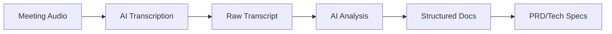

## Overview

AI-powered transcription tools are the foundation of the AI-Native SDLC, transforming verbal discussions into actionable documentation. These tools go beyond simple speech-to-text, providing intelligent summaries, action item extraction, and integration with development workflows.

## Tool Comparison

| Name | Cost | Strengths | Weaknesses |
|------|------|-----------|------------|
| **Granola** | $14/user/month | Real-time transcription with high accuracy, automatic action item extraction, meeting summary generation, searchable meeting history, integration with calendar systems, speaker identification and conversation flow, custom prompt templates for different meeting types | Subscription cost, requires stable internet connection, limited offline capabilities, may struggle with heavy accents or technical jargon |
| **Otter.ai** | Free tier available, paid plans start at $10/user/month | Excellent transcription accuracy, real-time collaboration features, integration with Zoom/Teams/Google Meet, mobile app with offline sync, custom vocabulary for technical terms | Limited AI analysis features compared to Granola, export options limited on free tier, no direct project management integration, less sophisticated action item extraction |
| **Fathom** | $19/user/month | Focus on sales and customer meetings, automatic CRM integration, call coaching and performance analytics, high-quality transcription, custom meeting templates | Primarily designed for sales use cases, higher cost for advanced features, limited general meeting support, less flexible than general-purpose tools |

## Key Features to Consider

### 1. **Transcription Accuracy**
- Speaker identification
- Technical vocabulary support
- Multi-accent handling
- Background noise filtering

### 2. **AI Analysis**
- Action item extraction
- Decision tracking
- Summary generation
- Sentiment analysis

### 3. **Integration Capabilities**
- Calendar synchronization
- Video conferencing platforms
- Project management tools
- Documentation systems

### 4. **Collaboration Features**
- Real-time editing
- Shared highlights
- Comment threads
- Team workspaces

## Implementation Best Practices

### Meeting Preparation
1. **Technical Setup**
   - Test audio quality before important meetings
   - Use quality microphones when possible
   - Minimize background noise
   - Ensure stable internet connection

2. **Meeting Structure**
   - Start with clear introductions
   - State decisions explicitly
   - Summarize action items
   - Confirm understanding

### During Meetings
```markdown
Best Practices:
✓ Speak clearly and avoid crosstalk
✓ Announce speaker changes
✓ Spell out technical terms
✓ Repeat important decisions
✓ Explicitly state action items
```

### Post-Meeting Workflow
1. **Review and Edit**
   - Correct any transcription errors
   - Highlight key decisions
   - Verify action items
   - Add context notes

2. **Integration Steps**
   - Export to documentation platform
   - Create tickets from action items
   - Share summaries with stakeholders
   - Archive for future reference

## Use Cases in AI-Native SDLC

### Requirements Gathering
- **Initial Planning Meetings**: Capture all stakeholder input
- **User Interviews**: Document user needs and pain points
- **Technical Discussions**: Record architecture decisions
- **Retrospectives**: Track lessons learned

### Documentation Generation


### Team Collaboration
- **Daily Standups**: Track progress and blockers
- **Design Reviews**: Capture feedback and decisions
- **Sprint Planning**: Document commitments
- **Knowledge Transfer**: Create searchable archives

## ROI Calculation

### Time Savings
- **Manual Note-Taking**: 30-40% of meeting time
- **Post-Meeting Documentation**: 1-2 hours per meeting
- **Action Item Tracking**: 30 minutes per meeting
- **Total Savings**: 2-3 hours per meeting

### Quality Improvements
- **Information Capture**: 95%+ vs. 40-60% manual
- **Action Item Completion**: 80%+ vs. 50% manual
- **Decision Traceability**: 100% with search
- **Knowledge Retention**: Permanent vs. declining

## Security Considerations

### Data Privacy
- Review vendor data policies
- Understand storage locations
- Check compliance certifications
- Implement access controls

### Sensitive Information
- Use private meeting modes
- Redact confidential data
- Control sharing permissions
- Regular security audits

## Getting Started

### 1. **Tool Selection**
- Evaluate based on your needs
- Consider integration requirements
- Test with pilot group
- Compare accuracy rates

### 2. **Team Training**
- Best practices workshop
- Integration setup
- Security guidelines
- Workflow optimization

### 3. **Measurement**
- Track time savings
- Monitor adoption rates
- Measure quality improvements
- Calculate ROI

## Recommended Stack

### For Small Teams
- **Tool**: Otter.ai (free tier)
- **Integration**: Manual export
- **Storage**: Cloud drive
- **Cost**: $0-50/month

### For Enterprises
- **Tool**: Granola
- **Integration**: API automation
- **Storage**: Enterprise cloud
- **Cost**: $14/user/month

## Future Trends

- **Multimodal Analysis**: Screen sharing and whiteboard capture
- **Real-time Translation**: Multi-language support
- **Advanced Analytics**: Meeting effectiveness metrics
- **Deeper Integration**: Native IDE and tool support

---

*Effective meetings are the foundation of successful projects. AI transcription ensures nothing important is lost.*