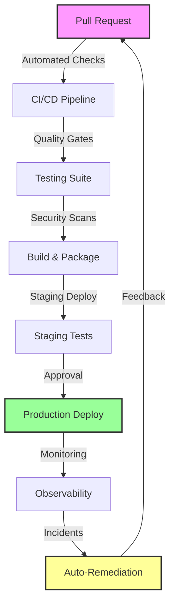
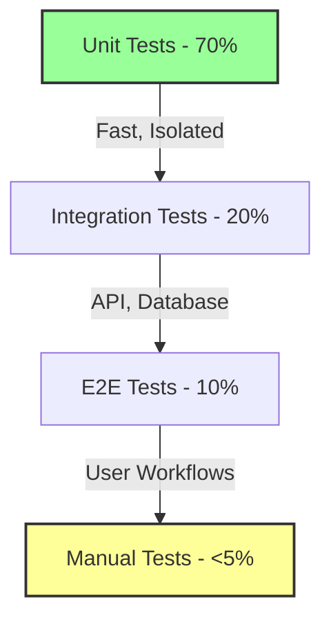
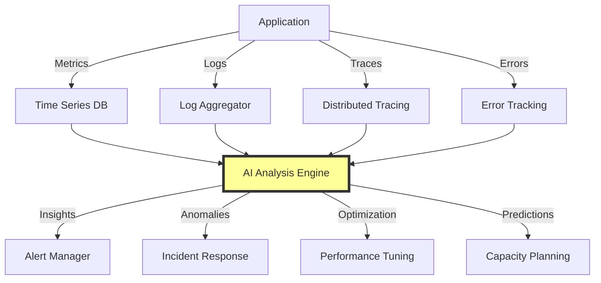

## Overview

The Deployment phase combines comprehensive quality assurance with automated deployment pipelines and continuous monitoring. This phase ensures that code moves from development to production safely while maintaining high quality and performance standards.

## Process Flow



## Step 1: CI/CD Pipeline Configuration

### Pipeline Architecture

```yaml
# .github/workflows/deploy.yml
name: AI-Native Deployment Pipeline

on:
  push:
    branches: [main]
  pull_request:
    branches: [main]

jobs:
  quality-gates:
    runs-on: ubuntu-latest
    steps:
      - name: Checkout Code
        uses: actions/checkout@v3
        
      - name: Setup Environment
        uses: actions/setup-node@v3
        with:
          node-version: '18'
          cache: 'npm'
      
      - name: Install Dependencies
        run: npm ci
      
      - name: Code Quality Checks
        run: |
          npm run lint
          npm run typecheck
          npm run format:check
      
      - name: Security Scanning
        run: |
          npm audit
          npm run security:scan
      
      - name: Run Tests
        run: |
          npm run test:unit -- --coverage
          npm run test:integration
          npm run test:e2e
      
      - name: Build Application
        run: npm run build
      
      - name: Upload Artifacts
        uses: actions/upload-artifact@v3
        with:
          name: build-artifacts
          path: dist/
```

### Quality Gates Configuration

| Gate | Threshold | Action on Failure |
|------|-----------|-------------------|
| **Code Coverage** | >80% | Block deployment |
| **Security Vulnerabilities** | 0 critical/high | Block deployment |
| **Performance Tests** | <2s response time | Warning + review |
| **E2E Tests** | 100% pass | Block deployment |
| **Code Quality** | A rating | Warning + review |

## Step 2: Comprehensive Testing Strategy

### Testing Pyramid Implementation



### AI-Enhanced Testing

1. **Test Generation**:
   ```typescript
   // AI-generated E2E test
   import { test, expect } from '@playwright/test';

   test.describe('User Authentication Flow', () => {
     test('should complete login successfully', async ({ page }) => {
       await page.goto('/login');
       
       // Fill login form
       await page.fill('[data-testid="email-input"]', 'user@example.com');
       await page.fill('[data-testid="password-input"]', 'securePassword');
       
       // Submit form
       await page.click('[data-testid="login-button"]');
       
       // Verify redirect to dashboard
       await expect(page).toHaveURL('/dashboard');
       await expect(page.locator('[data-testid="welcome-message"]'))
         .toContainText('Welcome back');
       
       // Verify user data loaded
       await expect(page.locator('[data-testid="user-profile"]'))
         .toBeVisible();
     });
     
     test('should handle login errors', async ({ page }) => {
       await page.goto('/login');
       
       // Submit with invalid credentials
       await page.fill('[data-testid="email-input"]', 'invalid@example.com');
       await page.fill('[data-testid="password-input"]', 'wrongPassword');
       await page.click('[data-testid="login-button"]');
       
       // Verify error message
       await expect(page.locator('[data-testid="error-message"]'))
         .toContainText('Invalid credentials');
     });
   });
   ```

2. **Visual Regression Testing**:
   ```javascript
   // percy.config.js
   module.exports = {
     version: 2,
     snapshot: {
       widths: [375, 768, 1280, 1920],
       minHeight: 1024,
       percyCSS: `
         /* Hide dynamic content */
         .timestamp { visibility: hidden; }
         .loading-spinner { display: none; }
       `
     },
     discovery: {
       allowedHostnames: ['localhost', 'staging.example.com'],
       networkIdleTimeout: 500
     }
   };
   ```

### Load Testing Configuration

```javascript
// k6-load-test.js
import http from 'k6/http';
import { check, sleep } from 'k6';

export const options = {
  stages: [
    { duration: '2m', target: 100 }, // Ramp up
    { duration: '5m', target: 100 }, // Stay at 100 users
    { duration: '2m', target: 200 }, // Spike test
    { duration: '5m', target: 200 }, // Sustained load
    { duration: '2m', target: 0 },   // Ramp down
  ],
  thresholds: {
    http_req_duration: ['p(95)<500'], // 95% of requests under 500ms
    http_req_failed: ['rate<0.1'],    // Error rate under 10%
  },
};

export default function () {
  const response = http.get('https://api.example.com/users');
  
  check(response, {
    'status is 200': (r) => r.status === 200,
    'response time < 500ms': (r) => r.timings.duration < 500,
    'has users data': (r) => JSON.parse(r.body).users.length > 0,
  });
  
  sleep(1);
}
```

## Step 3: Deployment Automation

### Multi-Stage Deployment

```yaml
# deployment-stages.yml
stages:
  - name: development
    trigger: automatic
    branch: develop
    environment:
      NODE_ENV: development
      API_URL: https://dev-api.example.com
    
  - name: staging
    trigger: automatic
    branch: main
    environment:
      NODE_ENV: staging
      API_URL: https://staging-api.example.com
    tests:
      - smoke
      - regression
      - load
    
  - name: production
    trigger: manual
    branch: main
    approval_required: true
    environment:
      NODE_ENV: production
      API_URL: https://api.example.com
    rollback:
      enabled: true
      strategy: blue-green
```

### Infrastructure as Code

```typescript
// infrastructure/app-stack.ts
import * as cdk from 'aws-cdk-lib';
import * as ecs from 'aws-cdk-lib/aws-ecs';
import * as ec2 from 'aws-cdk-lib/aws-ec2';

export class AppStack extends cdk.Stack {
  constructor(scope: Construct, id: string, props?: cdk.StackProps) {
    super(scope, id, props);

    // VPC for isolation
    const vpc = new ec2.Vpc(this, 'AppVPC', {
      maxAzs: 2,
      natGateways: 1,
    });

    // ECS Cluster
    const cluster = new ecs.Cluster(this, 'AppCluster', {
      vpc,
      containerInsights: true,
    });

    // Fargate Service
    const service = new ecs_patterns.ApplicationLoadBalancedFargateService(
      this, 'AppService', {
        cluster,
        cpu: 512,
        memoryLimitMiB: 1024,
        desiredCount: 2,
        taskImageOptions: {
          image: ecs.ContainerImage.fromRegistry('app:latest'),
          environment: {
            NODE_ENV: 'production',
          },
        },
      }
    );

    // Auto-scaling
    const scaling = service.service.autoScaleTaskCount({
      maxCapacity: 10,
      minCapacity: 2,
    });

    scaling.scaleOnCpuUtilization('CpuScaling', {
      targetUtilizationPercent: 70,
    });

    scaling.scaleOnMemoryUtilization('MemoryScaling', {
      targetUtilizationPercent: 80,
    });
  }
}
```

## Step 4: Release Management

### Automated Release Process

1. **Version Bumping**:
   ```json
   // release.config.js
   module.exports = {
     branches: ['main'],
     plugins: [
       '@semantic-release/commit-analyzer',
       '@semantic-release/release-notes-generator',
       '@semantic-release/changelog',
       '@semantic-release/npm',
       '@semantic-release/github',
       ['@semantic-release/git', {
         assets: ['CHANGELOG.md', 'package.json'],
         message: 'chore(release): ${nextRelease.version} [skip ci]'
       }]
     ]
   };
   ```

2. **Release Notes Generation**:
   ```markdown
   ## Release v2.1.0 - 2024-12-20
   
   ### Features
   - Added user authentication with JWT tokens (#123)
   - Implemented real-time notifications (#125)
   - Enhanced search functionality with filters (#127)
   
   ### Bug Fixes
   - Fixed memory leak in data processing (#124)
   - Resolved login redirect issue (#126)
   
   ### Performance Improvements
   - Optimized database queries (30% faster)
   - Reduced bundle size by 25%
   
   ### Breaking Changes
   - API endpoint `/users` now requires authentication
   
   🤖 Generated with AI assistance
   ```

## Step 5: Production Monitoring

### Observability Stack

```yaml
# monitoring-stack.yml
monitoring:
  metrics:
    provider: datadog
    config:
      api_key: ${DD_API_KEY}
      site: datadoghq.com
      tags:
        - env:production
        - service:api
      
  logging:
    provider: elasticsearch
    config:
      cluster: https://logs.example.com
      index: app-logs-${date}
      
  tracing:
    provider: jaeger
    config:
      endpoint: https://jaeger.example.com
      sampling_rate: 0.1
      
  error_tracking:
    provider: sentry
    config:
      dsn: ${SENTRY_DSN}
      environment: production
      traces_sample_rate: 0.1
```

### Alert Configuration

```yaml
# alerts.yml
alerts:
  - name: high_error_rate
    condition: error_rate > 5%
    duration: 5m
    severity: critical
    channels: [pagerduty, slack]
    
  - name: slow_response_time
    condition: p95_latency > 1000ms
    duration: 10m
    severity: warning
    channels: [slack]
    
  - name: memory_usage
    condition: memory_percent > 85%
    duration: 15m
    severity: warning
    channels: [slack, email]
    
  - name: deployment_failure
    condition: deployment_status == failed
    severity: critical
    channels: [pagerduty, slack, email]
```

## Step 6: Continuous Improvement

### AI-Powered Incident Response

1. **Automated Issue Creation**:
   ```typescript
   // error-handler.ts
   export class ErrorHandler {
     async handleProductionError(error: Error, context: ErrorContext) {
       // Log to monitoring
       logger.error('Production error occurred', { error, context });
       
       // Create Jira issue automatically
       const issue = await jiraClient.createIssue({
         project: 'PROD',
         issueType: 'Bug',
         priority: this.calculatePriority(error),
         summary: `Production Error: ${error.message}`,
         description: this.formatErrorDescription(error, context),
         labels: ['production', 'auto-created', 'ai-analysis'],
       });
       
       // Trigger AI analysis
       const analysis = await aiAssistant.analyzeError({
         error,
         stackTrace: error.stack,
         logs: await this.getRecentLogs(context),
         metrics: await this.getMetrics(context),
       });
       
       // Create fix PR if possible
       if (analysis.suggestedFix) {
         await this.createFixPR(analysis.suggestedFix, issue.key);
       }
       
       return { issue, analysis };
     }
   }
   ```

2. **Performance Optimization Loop**:
   ```mermaid
   graph LR
       A[Monitor Metrics] -->|Anomaly Detection| B[AI Analysis]
       B -->|Identify Bottleneck| C[Generate Fix]
       C -->|Create PR| D[Test & Deploy]
       D -->|Measure Impact| A
   ```

### Chaos Engineering

```yaml
# chaos-experiments.yml
experiments:
  - name: network_latency
    description: Add 100ms latency to database calls
    target: production
    schedule: weekly
    duration: 30m
    rollback: automatic
    
  - name: service_failure
    description: Kill random service instance
    target: staging
    schedule: daily
    duration: 15m
    success_criteria:
      - service_recovery < 30s
      - zero_customer_impact
      
  - name: memory_pressure
    description: Consume 80% of available memory
    target: staging
    schedule: weekly
    duration: 1h
    monitoring:
      - memory_usage
      - response_times
      - error_rates
```

## Success Metrics

### Deployment Metrics
- **Deployment Frequency**: 10+ per day
- **Lead Time**: <2 hours from commit to production
- **MTTR**: <30 minutes
- **Change Failure Rate**: <5%

### Quality Metrics
- **Production Bugs**: 50-70% reduction
- **Rollback Rate**: <2%
- **Test Coverage**: >85%
- **Performance SLA**: 99.9% uptime

### Automation Metrics
- **Manual Deployment Steps**: 0
- **Automated Rollback Success**: >95%
- **Self-Healing Incidents**: >60%
- **AI-Generated Fixes**: 30-40%

## Best Practices

### 1. **Progressive Delivery**
- Feature flags for gradual rollout
- Canary deployments
- A/B testing infrastructure
- Quick rollback capability

### 2. **Security Integration**
- Security scanning in pipeline
- Compliance validation
- Secret rotation
- Vulnerability patching

### 3. **Documentation**
- Automated deployment docs
- Runbook generation
- Architecture diagrams
- Incident postmortems

### 4. **Team Practices**
- Deployment reviews
- Blameless postmortems
- Knowledge sharing
- Continuous learning

## Common Pitfalls & Solutions

| Pitfall | Impact | Solution |
|---------|--------|----------|
| **Flaky Tests** | False failures | Test isolation, retry logic |
| **Long Deploy Times** | Slow feedback | Parallel execution, caching |
| **Missing Rollback** | Extended downtime | Blue-green deployment |
| **Alert Fatigue** | Missed incidents | Smart alerting, AI filtering |
| **Config Drift** | Environment issues | Infrastructure as Code |

## Tools & Resources

### Recommended Stack
- **CI/CD**: GitHub Actions, GitLab CI (Free-$50/user/month)
- **Monitoring**: DataDog, New Relic ($15-99/host/month)
- **Error Tracking**: Sentry ($26-89/month)
- **Testing**: Playwright, K6 (Free-$500/month)

### Templates & Examples
- [CI/CD Templates]({{ site.baseurl }}/templates/cicd)
- [Monitoring Configs]({{ site.baseurl }}/templates/monitoring)
- [Deployment Scripts]({{ site.baseurl }}/templates/deploy)
- [Incident Playbooks]({{ site.baseurl }}/templates/incidents)

## Next Steps

1. **Set Up Pipeline**: Configure CI/CD automation
2. **Implement Monitoring**: Deploy observability stack
3. **Create Runbooks**: Document procedures
4. **Train Team**: Deployment best practices
5. **Measure Success**: Track KPIs

Continue to [Phase 5: Production Monitoring & Continuous Improvement →](#monitoring)

---

## <a name="monitoring"></a>Phase 5: Production Monitoring & Continuous Improvement

### Overview

The final phase creates a closed feedback loop where production insights drive continuous improvements through AI-powered analysis and automated remediation.

### Monitoring Architecture



### Real-Time Dashboards

```yaml
# dashboard-config.yml
dashboards:
  - name: system_health
    refresh: 10s
    widgets:
      - type: timeseries
        metric: response_time_p95
        threshold: 500ms
        
      - type: counter
        metric: error_rate
        threshold: 1%
        
      - type: gauge
        metric: cpu_usage
        threshold: 80%
        
      - type: heatmap
        metric: request_distribution
        groupBy: endpoint
        
  - name: business_metrics
    refresh: 60s
    widgets:
      - type: number
        metric: active_users
        comparison: week_over_week
        
      - type: funnel
        metric: conversion_rate
        steps: [visit, signup, purchase]
        
      - type: map
        metric: user_distribution
        groupBy: country
```

### AI-Powered Analysis

1. **Anomaly Detection**:
   ```python
   # anomaly-detector.py
   class AnomalyDetector:
       def __init__(self, ml_model):
           self.model = ml_model
           self.baseline = self.calculate_baseline()
           
       def analyze_metrics(self, current_metrics):
           anomalies = []
           
           for metric_name, value in current_metrics.items():
               prediction = self.model.predict(metric_name, value)
               
               if self.is_anomalous(value, prediction):
                   anomaly = {
                       'metric': metric_name,
                       'value': value,
                       'expected': prediction,
                       'severity': self.calculate_severity(value, prediction),
                       'probable_causes': self.identify_causes(metric_name, value),
                       'recommended_actions': self.suggest_remediation(metric_name)
                   }
                   anomalies.append(anomaly)
                   
           return anomalies
   ```

2. **Root Cause Analysis**:
   ```typescript
   // root-cause-analyzer.ts
   export class RootCauseAnalyzer {
     async analyzeIncident(incident: Incident): Promise<RootCauseAnalysis> {
       // Gather context
       const logs = await this.getLogs(incident.timeRange);
       const metrics = await this.getMetrics(incident.timeRange);
       const deployments = await this.getDeployments(incident.timeRange);
       const changes = await this.getConfigChanges(incident.timeRange);
       
       // AI analysis
       const analysis = await this.aiService.analyze({
         incident,
         logs,
         metrics,
         deployments,
         changes,
         historicalIncidents: await this.getSimilarIncidents(incident)
       });
       
       return {
         rootCause: analysis.primaryCause,
         contributingFactors: analysis.secondaryFactors,
         affectedServices: analysis.impactedServices,
         suggestedFixes: analysis.recommendations,
         preventionMeasures: analysis.preventionSteps,
         estimatedTimeToResolve: analysis.mttr
       };
     }
   }
   ```

### Automated Remediation

```yaml
# auto-remediation.yml
remediations:
  - trigger: high_memory_usage
    conditions:
      - memory_percent > 90
      - duration > 5m
    actions:
      - name: restart_service
        type: kubernetes
        command: kubectl rollout restart deployment/api
        
  - trigger: slow_database_queries
    conditions:
      - query_time_p95 > 1000ms
      - affected_queries > 10
    actions:
      - name: analyze_queries
        type: ai_analysis
        prompt: "Analyze slow queries and suggest optimizations"
      - name: create_indexes
        type: database
        auto_approve: false
        
  - trigger: traffic_spike
    conditions:
      - request_rate > baseline * 3
      - error_rate < 5%
    actions:
      - name: auto_scale
        type: infrastructure
        command: scale_out(instances=2)
```

### Continuous Learning

1. **Performance Patterns**:
   - Track deployment impacts
   - Identify optimization opportunities
   - Predict capacity needs
   - Prevent recurring issues

2. **Feedback Integration**:
   - User behavior analysis
   - Feature usage metrics
   - Error pattern recognition
   - Performance trending

### Success Indicators

- **MTTR**: <30 minutes average
- **Self-Healing**: 60% of incidents
- **Prediction Accuracy**: >85%
- **Cost Optimization**: 20-30% reduction

---

*This complete lifecycle typically delivers 200-400% ROI in the first year through dramatic improvements in velocity, quality, and operational efficiency.*