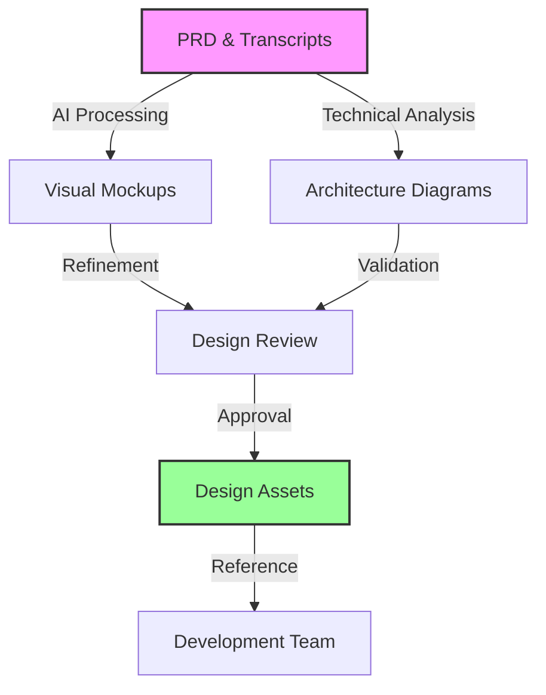

## Overview

The Design phase bridges the gap between requirements and implementation by leveraging AI to rapidly generate visual mockups, technical architectures, and API specifications. This approach ensures alignment between stakeholders and developers before any code is written.

## Process Flow



## Step 1: AI-Powered Mock Creation

### Input Preparation
Gather all relevant inputs for the AI design tools:
- **Product Requirements Document (PRD)**
- **Meeting transcripts with visual descriptions**
- **Brand guidelines and style guides**
- **Existing UI components or design systems**
- **Competitor references (if applicable)**

### Design Generation Process

**Effective Design Generation Prompt**:
```markdown
Based on the attached PRD for [Project Name], create a visual mockup for the following screen:

Screen: [Screen Name]
Purpose: [Main functionality]

Requirements:
- [List specific features from PRD]
- [User actions needed]
- [Data to display]

Design constraints:
- Follow [Brand Name] design system
- Mobile-first responsive design
- Accessibility WCAG 2.1 AA compliant
- [Any specific constraints]

Include:
- Navigation elements
- Form inputs with validation states
- Call-to-action buttons
- Error and success states
- Loading states

Style: [Modern/Minimal/Corporate/etc.]
```

### AI Design Tools Workflow

1. **Initial Generation**:
   - Feed PRD sections to AI design tool
   - Generate multiple variations
   - Export as editable files
   - Document design decisions

2. **Component Library Creation**:
   - Extract reusable components
   - Build design system
   - Create style guide
   - Document usage patterns

3. **Interactive Prototypes**:
   - Link screens together
   - Add transitions
   - Define user flows
   - Create clickable demos

## Step 2: Technical Architecture Design

### System Architecture Generation

**Architecture Diagram Prompt**:
```markdown
Create a system architecture diagram for the following application:

Application: [Name]
Type: [Web/Mobile/Desktop]
Scale: [Users/Requests per second]

Technical Requirements:
- [List from PRD]
- Database needs
- External integrations
- Performance requirements

Include:
- Frontend components
- Backend services
- Database layer
- External APIs
- Security boundaries
- Data flow arrows

Use standard architecture notation.
```

### Architecture Components

| Component | Purpose | Design Considerations |
|-----------|---------|----------------------|
| **Frontend** | User interface | Framework, state management, routing |
| **API Layer** | Service communication | REST/GraphQL, authentication, rate limiting |
| **Backend** | Business logic | Microservices vs monolith, scaling strategy |
| **Database** | Data persistence | SQL vs NoSQL, sharding, replication |
| **Cache** | Performance | Redis, CDN, browser caching |
| **Security** | Protection | Firewalls, encryption, access control |

## Step 3: API Contract Design

### API Specification Generation

**API Design Prompt**:
```markdown
Based on the PRD, design RESTful API endpoints for [Feature Name]:

Include for each endpoint:
1. HTTP method and path
2. Request headers
3. Request body schema
4. Response schema (success and error)
5. Status codes
6. Authentication requirements
7. Rate limiting rules

Follow OpenAPI 3.0 specification format.
```

### Example API Design Output

```yaml
openapi: 3.0.0
info:
  title: User Authentication API
  version: 1.0.0

paths:
  /auth/login:
    post:
      summary: User login
      requestBody:
        required: true
        content:
          application/json:
            schema:
              type: object
              required:
                - email
                - password
              properties:
                email:
                  type: string
                  format: email
                password:
                  type: string
                  minLength: 8
      responses:
        200:
          description: Successful login
          content:
            application/json:
              schema:
                type: object
                properties:
                  token:
                    type: string
                  user:
                    $ref: '#/components/schemas/User'
        401:
          description: Invalid credentials
```

## Step 4: Database Schema Design

### Schema Generation Process

**Database Schema Prompt**:
```markdown
Design a database schema for [Application Name] with these entities:
[List entities from PRD]

For each entity include:
- Table name (plural)
- Columns with data types
- Primary and foreign keys
- Indexes for common queries
- Constraints and validations

Consider:
- Normalization (3NF)
- Performance optimization
- Future scalability
- Data integrity
```

### Schema Documentation

```sql
-- Example: User Management Schema
CREATE TABLE users (
    id UUID PRIMARY KEY DEFAULT gen_random_uuid(),
    email VARCHAR(255) UNIQUE NOT NULL,
    password_hash VARCHAR(255) NOT NULL,
    created_at TIMESTAMP DEFAULT CURRENT_TIMESTAMP,
    updated_at TIMESTAMP DEFAULT CURRENT_TIMESTAMP,
    
    INDEX idx_users_email (email)
);

CREATE TABLE user_profiles (
    user_id UUID PRIMARY KEY,
    full_name VARCHAR(255) NOT NULL,
    avatar_url VARCHAR(500),
    bio TEXT,
    
    FOREIGN KEY (user_id) REFERENCES users(id) ON DELETE CASCADE
);
```

## Step 5: Design Integration

### Deliverable Organization

1. **Design Package Structure**:
   ```
   /design-assets/
   ├── mockups/
   │   ├── desktop/
   │   ├── mobile/
   │   └── tablet/
   ├── architecture/
   │   ├── system-overview.pdf
   │   ├── component-diagram.pdf
   │   └── data-flow.pdf
   ├── api/
   │   ├── openapi-spec.yaml
   │   └── postman-collection.json
   └── database/
       ├── schema.sql
       └── erd-diagram.pdf
   ```

2. **Design Handoff Checklist**:
   - [ ] All screens designed and approved
   - [ ] Interactive prototype available
   - [ ] Architecture diagrams reviewed
   - [ ] API contracts finalized
   - [ ] Database schema validated
   - [ ] Design tokens exported
   - [ ] Assets optimized and exported

### Integration with Development

1. **Attach to User Stories**:
   - Link mockups to relevant tickets
   - Include design specifications
   - Document interaction patterns
   - Provide asset downloads

2. **Developer Resources**:
   - Style guide with code snippets
   - Component usage examples
   - API testing collection
   - Database migration scripts

## Success Metrics

### Efficiency Metrics
- **Design Time**: 70% reduction (1 week → 1-2 days)
- **Revision Cycles**: 50% fewer iterations
- **Handoff Time**: 80% faster to development
- **Asset Creation**: 90% faster with AI

### Quality Metrics
- **Design Consistency**: 95% adherence to system
- **Stakeholder Approval**: First-pass approval 85%
- **Developer Clarity**: 60% fewer questions
- **Implementation Accuracy**: 90% match to design

## Best Practices

### 1. **Iterative Refinement**
- Start with low-fidelity wireframes
- Progress to high-fidelity mockups
- Get feedback at each stage
- Document design decisions

### 2. **Maintain Design System**
- Build reusable components
- Document patterns
- Version control designs
- Regular audits

### 3. **Collaboration**
- Include developers early
- Regular design reviews
- Stakeholder validation
- Accessibility testing

### 4. **Technical Feasibility**
- Validate with tech team
- Consider performance
- Plan for edge cases
- Mobile-first approach

## Common Pitfalls & Solutions

| Pitfall | Impact | Solution |
|---------|--------|----------|
| **Over-designing** | Delayed development | MVP focus first |
| **Ignoring constraints** | Technical debt | Early validation |
| **Poor handoff** | Implementation errors | Detailed specs |
| **Inconsistent design** | User confusion | Design system |
| **Missing states** | Incomplete implementation | State checklist |

## Tools & Resources

### Recommended Stack
- **AI Design**: Figma with AI plugins ($15/user/month)
- **Prototyping**: Framer ($20/user/month)
- **Architecture**: Draw.io or Lucidchart (Free/$9/user/month)
- **API Design**: Stoplight Studio (Free)

### Templates & Examples
- [Mockup Templates]({{ site.baseurl }}/templates/mockups)
- [Architecture Patterns]({{ site.baseurl }}/templates/architecture)
- [API Contract Examples]({{ site.baseurl }}/templates/api)
- [Database Schema Patterns]({{ site.baseurl }}/templates/database)

## Next Steps

1. **Set Up Design Tools**: Configure AI-enabled design software
2. **Create Design System**: Build component library
3. **Define Standards**: Establish design guidelines
4. **Train Team**: Ensure design tool proficiency
5. **Run Pilot**: Test with one feature

Continue to [Phase 3: Development Planning & Implementation →]({{ site.baseurl }}/sdlc/development/)

---

*This phase typically reduces design time by 70% while improving consistency and developer handoff quality.*