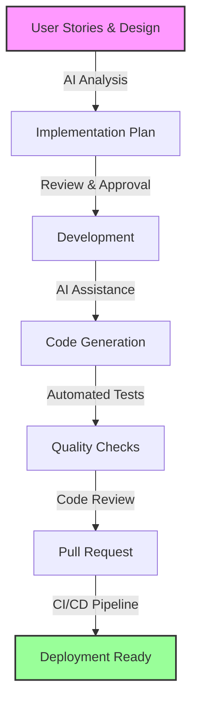

## Overview

The Development phase leverages AI coding assistants to transform approved designs and requirements into working software. This phase emphasizes automation, quality guardrails, and maintaining high standards while dramatically increasing development velocity.

## Process Flow



## Step 1: AI-Powered Development Planning

### Implementation Planning Process

**Comprehensive Planning Prompt**:
```markdown
Analyze the following user story and create a detailed implementation plan:

[Insert User Story with Acceptance Criteria]

Include:
1. Architecture decisions and patterns to use
2. File structure and module organization
3. API endpoints and contracts
4. Data models and database changes
5. Test strategy (unit, integration, e2e)
6. Error handling approach
7. Security considerations
8. Performance optimizations
9. Documentation requirements

Consider:
- Existing codebase patterns in [repository]
- Technology stack: [list technologies]
- Coding standards: [link to standards]
- Non-functional requirements: [list]

Format as a structured plan with clear sections.
```

### Plan Components

| Component | Details | Validation |
|-----------|---------|------------|
| **Architecture** | Patterns, structure, dependencies | Tech lead review |
| **API Design** | Endpoints, payloads, responses | Contract testing |
| **Data Models** | Entities, relationships, migrations | Schema validation |
| **Test Strategy** | Coverage targets, test types | QA approval |
| **Security** | Auth, validation, encryption | Security scan |

## Step 2: Development Implementation

### AI Coding Assistant Configuration

1. **Context Setup**:
   ```markdown
   # .claude-context or .github/copilot-context
   
   Project: [Project Name]
   Stack: TypeScript, React, Node.js, PostgreSQL
   
   Patterns:
   - Use functional components with hooks
   - Implement error boundaries
   - Follow REST conventions
   - Use dependency injection
   
   Standards:
   - ESLint configuration: .eslintrc
   - Prettier formatting: .prettierrc
   - Test coverage minimum: 80%
   ```

2. **Custom Instructions**:
   ```markdown
   When generating code:
   1. Follow existing patterns in the codebase
   2. Include comprehensive error handling
   3. Write tests alongside implementation
   4. Add JSDoc comments for public APIs
   5. Use meaningful variable names
   6. Implement logging for debugging
   7. Consider edge cases
   8. Optimize for readability
   ```

### Implementation Workflow

1. **Feature Development**:
   ```typescript
   // Example: AI-generated user service
   import { Injectable } from '@nestjs/common';
   import { InjectRepository } from '@nestjs/typeorm';
   import { Repository } from 'typeorm';
   import { User } from './entities/user.entity';
   import { CreateUserDto } from './dto/create-user.dto';
   import { Logger } from '../common/logger';

   @Injectable()
   export class UserService {
     private readonly logger = new Logger(UserService.name);

     constructor(
       @InjectRepository(User)
       private userRepository: Repository<User>,
     ) {}

     async create(createUserDto: CreateUserDto): Promise<User> {
       this.logger.log('Creating new user', { email: createUserDto.email });
       
       try {
         const user = this.userRepository.create(createUserDto);
         const savedUser = await this.userRepository.save(user);
         
         this.logger.log('User created successfully', { userId: savedUser.id });
         return savedUser;
       } catch (error) {
         this.logger.error('Failed to create user', error);
         throw new Error('User creation failed');
       }
     }
   }
   ```

2. **Test Generation**:
   ```typescript
   // AI-generated test suite
   describe('UserService', () => {
     let service: UserService;
     let repository: MockRepository<User>;

     beforeEach(async () => {
       const module = await Test.createTestingModule({
         providers: [
           UserService,
           {
             provide: getRepositoryToken(User),
             useClass: MockRepository,
           },
         ],
       }).compile();

       service = module.get<UserService>(UserService);
       repository = module.get<MockRepository<User>>(getRepositoryToken(User));
     });

     describe('create', () => {
       it('should create a new user', async () => {
         const createUserDto: CreateUserDto = {
           email: 'test@example.com',
           name: 'Test User',
         };

         const savedUser = { id: '123', ...createUserDto };
         repository.create.mockReturnValue(savedUser);
         repository.save.mockResolvedValue(savedUser);

         const result = await service.create(createUserDto);

         expect(result).toEqual(savedUser);
         expect(repository.create).toHaveBeenCalledWith(createUserDto);
         expect(repository.save).toHaveBeenCalled();
       });

       it('should handle creation errors', async () => {
         repository.save.mockRejectedValue(new Error('Database error'));

         await expect(service.create(createUserDto))
           .rejects.toThrow('User creation failed');
       });
     });
   });
   ```

## Step 3: AI Guardrails Implementation

### Comprehensive Guardrails Table

| Job Name | Purpose | When Run | Tools Used |
|----------|---------|----------|------------|
| **commit_message_validation** | Validates conventional commit format and AI authorship | Commit Hook + CI/CD | commitlint, custom scripts |
| **pr_message_validation** | Validates comprehensive PR description | CI/CD | GitHub Actions, custom validators |
| **lint** | Enforces code style and quality standards | Pre-commit + CI/CD | ESLint, Prettier, language-specific linters |
| **typecheck** | Static type checking | Pre-commit + CI/CD | TypeScript, Flow, mypy |
| **test_unit** | Runs unit tests | Pre-commit + CI/CD | Jest, pytest, JUnit |
| **test_integration** | Runs integration tests | CI/CD | Jest, pytest, Postman |
| **test_e2e** | End-to-end browser tests | CI/CD | Playwright, Cypress, Selenium |
| **visual_regression_test** | Visual UI testing | CI/CD | Percy, Chromatic, BackstopJS |
| **format** | Code formatting consistency | Pre-commit + CI/CD | Prettier, Black, gofmt |
| **build** | Project compilation | CI/CD | Webpack, tsc, Maven |
| **dependency_security_scan** | Vulnerability scanning | CI/CD | Snyk, npm audit, OWASP |
| **static_security_testing** | SAST analysis | CI/CD | SonarQube, CodeQL, Checkmarx |
| **secret_scanning** | Detect hardcoded secrets | CI/CD | GitGuardian, TruffleHog |
| **license_compliance** | OSS license validation | CI/CD | FOSSA, WhiteSource |
| **code_quality_check** | AI-powered quality review | CI/CD | CodeClimate, DeepCode |
| **compliance_validation** | Framework compliance | CI/CD | Custom validators |

### Guardrail Configuration Example

```yaml
# .github/workflows/guardrails.yml
name: AI Development Guardrails

on:
  pull_request:
    types: [opened, synchronize]
  push:
    branches: [main, develop]

jobs:
  quality-checks:
    runs-on: ubuntu-latest
    steps:
      - uses: actions/checkout@v3
      
      - name: Validate Commit Messages
        run: |
          npm install -g @commitlint/cli
          commitlint --from=${{ github.event.pull_request.base.sha }}
      
      - name: Run Linting
        run: |
          npm run lint
          npm run format:check
      
      - name: Type Checking
        run: npm run typecheck
      
      - name: Unit Tests
        run: npm run test:unit -- --coverage
      
      - name: Security Scanning
        uses: snyk/actions/node@master
        env:
          SNYK_TOKEN: ${{ secrets.SNYK_TOKEN }}
      
      - name: SAST Analysis
        uses: github/super-linter@v4
        env:
          GITHUB_TOKEN: ${{ secrets.GITHUB_TOKEN }}
```

## Step 4: Code Review Process

### AI-Assisted Review

1. **Automated PR Description**:
   ```markdown
   ## Summary
   This PR implements user authentication functionality as specified in JIRA-123.
   
   ## Changes
   - Added login endpoint with JWT token generation
   - Implemented password hashing with bcrypt
   - Created user session management
   - Added comprehensive test coverage (92%)
   
   ## Testing
   - [x] Unit tests passing
   - [x] Integration tests passing
   - [x] Manual testing completed
   - [x] Security scan passed
   
   ## Checklist
   - [x] Code follows project conventions
   - [x] Tests cover edge cases
   - [x] Documentation updated
   - [x] No security vulnerabilities
   
   🤖 Generated with AI assistance
   Co-authored-by: AI Assistant <ai@example.com>
   ```

2. **Review Focus Areas**:
   - Business logic correctness
   - Security vulnerabilities
   - Performance implications
   - Code maintainability
   - Test coverage

### Human Review Guidelines

| Review Aspect | What to Check | Red Flags |
|---------------|---------------|-----------|
| **Business Logic** | Correctness, edge cases | Assumptions, missing validation |
| **Security** | Auth, input validation | Hardcoded secrets, SQL injection |
| **Performance** | Queries, algorithms | N+1 queries, inefficient loops |
| **Maintainability** | Readability, patterns | Complex functions, poor naming |
| **Testing** | Coverage, scenarios | Missing edge cases, brittle tests |

## Step 5: Documentation Generation

### Automated Documentation

**Documentation Generation Prompt**:
```markdown
Generate comprehensive documentation for this code:
[Insert code]

Include:
1. Overview and purpose
2. API documentation with examples
3. Configuration options
4. Usage examples
5. Error handling
6. Performance considerations
7. Security notes
8. Troubleshooting guide
```

### Documentation Types

1. **API Documentation**:
   ```typescript
   /**
    * Creates a new user account
    * 
    * @param {CreateUserDto} createUserDto - User creation data
    * @returns {Promise<User>} The created user object
    * @throws {ConflictException} If email already exists
    * @throws {BadRequestException} If validation fails
    * 
    * @example
    * const user = await userService.create({
    *   email: 'user@example.com',
    *   name: 'John Doe',
    *   password: 'securePassword123'
    * });
    */
   ```

2. **README Updates**:
   ```markdown
   ## User Authentication Module
   
   ### Features
   - JWT-based authentication
   - Password hashing with bcrypt
   - Session management
   - Role-based access control
   
   ### Installation
   ```bash
   npm install
   npm run migration:run
   ```
   
   ### Configuration
   ```env
   JWT_SECRET=your-secret-key
   JWT_EXPIRATION=7d
   BCRYPT_ROUNDS=10
   ```
   ```

## Success Metrics

### Development Velocity
- **Lines of Code per Day**: 200-400 (150-200% increase)
- **Feature Completion**: 160-140% faster
- **Bug Fix Time**: 75-80% reduction
- **Code Review Time**: 80-85% reduction

### Code Quality
- **Test Coverage**: 85-95%
- **Code Duplication**: <5%
- **Cyclomatic Complexity**: <10
- **Security Vulnerabilities**: 0 critical/high

### Documentation
- **API Coverage**: 100%
- **Code Comments**: All public methods
- **README Completeness**: 95%
- **Update Frequency**: With each PR

## Best Practices

### 1. **Context Maintenance**
- Keep AI context files updated
- Document patterns and conventions
- Share knowledge across team
- Regular context reviews

### 2. **Test-Driven Development**
- Write tests first or alongside code
- Aim for high coverage
- Test edge cases
- Automate test execution

### 3. **Security First**
- Input validation on all endpoints
- Parameterized queries
- Secure secret management
- Regular dependency updates

### 4. **Performance Optimization**
- Profile before optimizing
- Use caching strategically
- Optimize database queries
- Monitor resource usage

## Common Pitfalls & Solutions

| Pitfall | Impact | Solution |
|---------|--------|----------|
| **Over-reliance on AI** | Poor code quality | Human review critical |
| **Ignoring context** | Inconsistent code | Maintain context files |
| **Skipping tests** | Production bugs | Enforce coverage |
| **Poor documentation** | Maintenance issues | Automate generation |
| **Security oversights** | Vulnerabilities | Automated scanning |

## Tools & Resources

### Recommended Stack
- **AI Coding**: Cursor, GitHub Copilot ($20-39/user/month)
- **IDE**: VS Code with AI extensions (Free)
- **Testing**: Jest, Playwright ($0-500/month)
- **Security**: Snyk, SonarQube ($32-98/month)

### Templates & Examples
- [Code Templates]({{ site.baseurl }}/templates/code)
- [Test Patterns]({{ site.baseurl }}/templates/tests)
- [CI/CD Configs]({{ site.baseurl }}/templates/cicd)
- [Documentation Templates]({{ site.baseurl }}/templates/docs)

## Next Steps

1. **Configure AI Tools**: Set up coding assistants
2. **Implement Guardrails**: Deploy CI/CD checks
3. **Create Templates**: Standardize patterns
4. **Train Team**: AI tool proficiency
5. **Measure Impact**: Track metrics

Continue to [Phase 4: Quality Assurance & Deployment →]({{ site.baseurl }}/sdlc/deployment/)

---

*This phase typically increases development velocity by 150-200% while maintaining or improving code quality.*