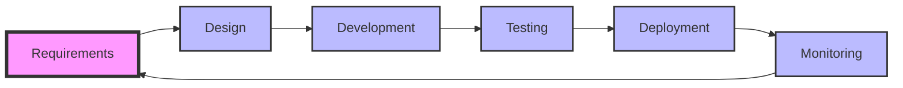

## Overview

The AI-Native SDLC represents a fundamental shift in how software is conceived, developed, and maintained. By integrating AI tools at every phase, teams can achieve unprecedented efficiency while maintaining high quality and security standards.

## SDLC Phases



### [Phase 1: Requirements Capture & Analysis](/sdlc/requirements/)

Transform stakeholder conversations into comprehensive documentation using AI.

**Key Activities:**
- AI-transcribed planning meetings
- Automated PRD generation
- Gap analysis and refinement
- Stakeholder validation

**Tools Used:**
- AI transcription (Granola, Otter.ai)
- AI development assistant (Claude, ChatGPT)
- Documentation platforms (Confluence, Notion)

**Deliverables:**
- Product Requirements Document (PRD)
- Technical specifications
- Acceptance criteria
- Risk assessment

### [Phase 1.5: Design Generation](/sdlc/design/)

Convert requirements into visual mockups and technical designs.

**Key Activities:**
- AI-powered mockup creation
- Architecture diagram generation
- API contract design
- User flow mapping

**Tools Used:**
- AI design software (Figma, Framer)
- Diagramming tools
- API design platforms

**Deliverables:**
- UI/UX mockups
- System architecture diagrams
- API specifications
- Database schemas

### [Phase 2: Story Creation & Task Breakdown](/sdlc/requirements/#story-creation)

Transform requirements into actionable development tasks.

**Key Activities:**
- BDD story generation
- Task decomposition
- Estimation and prioritization
- Sprint planning

**Tools Used:**
- AI development assistant
- Project management (Jira, Linear)
- Estimation tools

**Deliverables:**
- User stories with acceptance criteria
- Technical tasks
- Sprint backlog
- Dependency mapping

### [Phase 3: Development Planning & Implementation](/sdlc/development/)

AI-assisted coding with comprehensive guardrails.

**Key Activities:**
- AI-powered code generation
- Test-driven development
- Code review automation
- Documentation generation

**Tools Used:**
- AI coding assistants (Cursor, GitHub Copilot)
- IDE integrations
- Testing frameworks
- Documentation generators

**Deliverables:**
- Feature implementation
- Unit and integration tests
- API documentation
- Code comments

### [Phase 4: Quality Assurance & Deployment](/sdlc/deployment/)

Automated testing and deployment with AI-powered monitoring.

**Key Activities:**
- Automated testing execution
- AI-powered code review
- Deployment automation
- Performance optimization

**Tools Used:**
- CI/CD platforms (GitHub Actions, GitLab CI)
- Testing frameworks
- Deployment tools
- Monitoring solutions

**Deliverables:**
- Test reports
- Deployment packages
- Release notes
- Performance metrics

### [Phase 5: Production Monitoring & Continuous Improvement](/sdlc/deployment/#monitoring)

Closed-loop monitoring with automated incident response.

**Key Activities:**
- Real-time monitoring
- Automated incident creation
- AI-powered root cause analysis
- Continuous optimization

**Tools Used:**
- APM solutions (DataDog, New Relic)
- Error tracking (Sentry)
- AI analysis tools
- Incident management

**Deliverables:**
- Performance reports
- Incident resolutions
- Optimization recommendations
- Trend analysis

## AI Guardrails

Critical quality gates enforced throughout the lifecycle:

| Guardrail | Purpose | When Applied |
|-----------|---------|--------------|
| **Code Quality** | Enforce standards | Pre-commit, CI/CD |
| **Security Scanning** | Identify vulnerabilities | Every commit |
| **Test Coverage** | Ensure quality | Pull request |
| **Performance Tests** | Prevent degradation | Pre-deployment |
| **Documentation** | Maintain clarity | With code changes |

[View Complete Guardrails Table →](/sdlc/development/#ai-guardrails)

## Integration Points

### Tool Integrations
- **IDE ↔ AI Assistant**: Real-time code suggestions
- **Project Management ↔ Version Control**: Automated status updates
- **CI/CD ↔ Monitoring**: Deployment tracking
- **Error Tracking ↔ AI Analysis**: Automated fixes

### Data Flow
```
Requirements → Design → Code → Tests → Deployment → Monitoring
     ↑                                                    ↓
     └──────────────── Feedback Loop ────────────────────┘
```

## Success Metrics

### Velocity Metrics
- **Feature Delivery**: 160-140% increase
- **Time to Market**: 70-80% reduction
- **Bug Fix Time**: 75-80% reduction

### Quality Metrics
- **Defect Rate**: 40-50% reduction
- **Test Coverage**: 25-35% increase
- **Code Review Time**: 80-85% reduction

### Business Metrics
- **Development Cost**: 40-50% reduction
- **Time to Revenue**: 60-70% faster
- **Customer Satisfaction**: 15-25% increase

## Best Practices

### 1. **Maintain Human Oversight**
- Review AI-generated code
- Validate business logic
- Ensure security compliance
- Monitor quality metrics

### 2. **Iterative Refinement**
- Start with pilot projects
- Measure and adjust
- Scale gradually
- Continuous learning

### 3. **Documentation Excellence**
- Maintain context files
- Document AI interactions
- Create knowledge base
- Regular updates

### 4. **Security First**
- Code scanning before AI
- Access controls
- Audit trails
- Regular reviews

## Implementation Roadmap

### Month 1-2: Foundation
- Tool selection and setup
- Team training
- Pilot project selection
- Baseline metrics

### Month 3-4: Pilot Implementation
- Apply to 1-2 projects
- Measure results
- Gather feedback
- Refine processes

### Month 5-6: Expansion
- Roll out to more teams
- Advanced training
- Process optimization
- Success stories

### Month 7+: Maturity
- Full adoption
- Continuous improvement
- Advanced use cases
- Knowledge sharing

## Next Steps

1. **Review Individual Phases**:
   - [Requirements & Analysis](/sdlc/requirements/)
   - [Design Generation](/sdlc/design/)
   - [Development & Implementation](/sdlc/development/)
   - [Deployment & Monitoring](/sdlc/deployment/)

2. **Explore Supporting Topics**:
   - [AI Tool Comparisons](/ai-tools/)
   - [Governance Framework](/governance/)
   - [Implementation Guide](/implementation/)

3. **Get Started**:
   - [Download Implementation Checklist](#)
   - [View Case Studies](#)
   - [Contact for Training](#)

---

*The AI-Native SDLC is continuously evolving. This guide represents current best practices as of December 2024.*