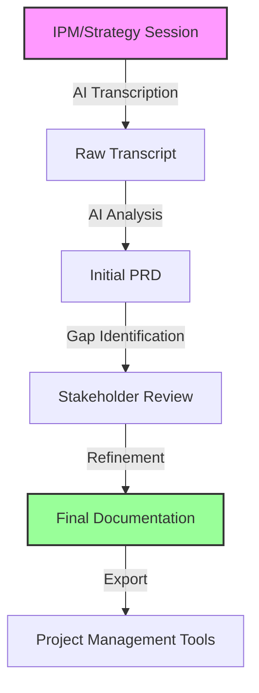

## Overview

The Requirements phase leverages AI to transform unstructured stakeholder conversations into comprehensive, actionable documentation. This approach ensures nothing is lost in translation and dramatically reduces the time from idea to implementation.

## Process Flow



## Step 1: Initial Planning Meeting (IPM)

### Preparation
- **Schedule**: 60-90 minute sessions with all stakeholders
- **Tools**: AI transcription software (Granola, Otter.ai)
- **Attendees**: Product owner, technical lead, key stakeholders
- **Agenda**: Business goals, technical constraints, success criteria

### Best Practices
1. **Pre-meeting Setup**:
   ```
   - Test transcription software
   - Share agenda in advance
   - Prepare question templates
   - Set recording permissions
   ```

2. **During the Meeting**:
   - Speak clearly and avoid crosstalk
   - Summarize key decisions
   - Call out action items explicitly
   - Clarify technical terms

3. **Capture Everything**:
   - Business objectives
   - Technical requirements
   - Constraints and dependencies
   - Success metrics
   - Timeline expectations

## Step 2: AI-Powered Documentation Generation

### Prompt Engineering

**Effective PRD Generation Prompt**:
```markdown
Using the attached meeting transcript, create a comprehensive Product Requirements Document (PRD) that includes:

1. Executive Summary
2. Business Objectives with success metrics
3. User Stories in BDD format
4. Technical Requirements and constraints
5. Dependencies and risks
6. Timeline and milestones
7. Acceptance criteria for each feature

Also identify:
- Any gaps or ambiguities that need clarification
- Conflicting requirements that need resolution
- Missing stakeholder perspectives
- Technical feasibility concerns

Format the output as a structured document with clear sections and bullet points.
```

### AI Assistant Configuration
- **Model Selection**: Use advanced models (GPT-4, Claude) for better comprehension
- **Context Window**: Include full transcript plus any reference documents
- **Temperature**: Lower (0.3-0.5) for more consistent output
- **Multiple Passes**: Generate, review, refine

## Step 3: Gap Analysis & Refinement

### Common Gaps to Address

| Gap Type | Questions to Ask | Resolution Approach |
|----------|------------------|---------------------|
| **Functional** | What specific features are needed? | Detailed user stories |
| **Non-functional** | Performance, security requirements? | Define SLAs and metrics |
| **Integration** | Which systems need to connect? | API specifications |
| **Data** | What data is involved? | Data models and flow |
| **UX/UI** | How should it look and feel? | Mockups and wireframes |

### Refinement Process
1. **AI-Assisted Gap Identification**:
   ```
   Review the PRD and identify:
   - Vague requirements needing specificity
   - Missing error handling scenarios
   - Undefined edge cases
   - Incomplete acceptance criteria
   ```

2. **Stakeholder Clarification**:
   - Send targeted questions
   - Schedule follow-up if needed
   - Document all responses
   - Update PRD iteratively

3. **Technical Validation**:
   - Architecture review
   - Feasibility assessment
   - Risk identification
   - Effort estimation

## Step 4: Story Creation & Task Breakdown

### BDD Story Format

**Template**:
```gherkin
Feature: [Feature Name]
  As a [user type]
  I want [goal/desire]
  So that [benefit/value]

  Scenario: [Scenario Name]
    Given [initial context]
    When [action/event]
    Then [expected outcome]
    And [additional outcomes]
```

**Example**:
```gherkin
Feature: User Authentication
  As a registered user
  I want to log in with my credentials
  So that I can access my personalized dashboard

  Scenario: Successful login
    Given I am on the login page
    When I enter valid credentials
    Then I should be redirected to my dashboard
    And I should see a welcome message
```

### Task Decomposition

**AI Prompt for Task Breakdown**:
```markdown
Break down this user story into development tasks:
[Insert User Story]

Include:
1. Frontend tasks
2. Backend tasks
3. Database changes
4. API endpoints
5. Test scenarios
6. Documentation needs

Estimate each task in story points (1, 2, 3, 5, 8).
```

## Step 5: Documentation Export

### Integration Strategies

1. **Project Management Platforms**:
   - Jira: Use REST API for bulk creation
   - Linear: GraphQL API for issues
   - Asana: Webhook integration

2. **Documentation Platforms**:
   - Confluence: Direct API integration
   - Notion: Database API
   - GitBook: Git-based workflow

3. **Version Control**:
   - Store PRD in repository
   - Track changes with Git
   - Link to issues/PRs

### Automation Scripts

**Example: Jira Integration**:
```python
import requests
import json

def create_jira_stories(stories, project_key):
    """Create user stories in Jira from PRD"""
    jira_url = "https://your-domain.atlassian.net"
    api_endpoint = f"{jira_url}/rest/api/3/issue"
    
    headers = {
        "Authorization": f"Bearer {API_TOKEN}",
        "Content-Type": "application/json"
    }
    
    for story in stories:
        issue_data = {
            "fields": {
                "project": {"key": project_key},
                "summary": story["title"],
                "description": story["description"],
                "issuetype": {"name": "Story"},
                "acceptance_criteria": story["acceptance_criteria"]
            }
        }
        
        response = requests.post(
            api_endpoint,
            headers=headers,
            data=json.dumps(issue_data)
        )
```

## Success Metrics

### Efficiency Gains
- **Documentation Time**: 80% reduction (2 days → 4 hours)
- **Requirement Clarity**: 60% fewer clarification requests
- **Story Creation**: 90% faster with AI assistance
- **Stakeholder Satisfaction**: 40% improvement

### Quality Improvements
- **Requirement Coverage**: 95%+ completeness
- **Ambiguity Reduction**: 70% fewer unclear requirements
- **Traceability**: 100% requirement to story mapping
- **Change Management**: 50% faster requirement updates

## Best Practices

### 1. **Continuous Context**
- Maintain conversation thread with AI
- Reference previous decisions
- Build on existing knowledge
- Version control everything

### 2. **Human Validation**
- Always review AI output
- Verify business logic
- Confirm technical accuracy
- Get stakeholder sign-off

### 3. **Iterative Refinement**
- Start with rough draft
- Refine through multiple passes
- Incorporate feedback quickly
- Keep documentation current

### 4. **Template Library**
- Build reusable prompts
- Create story templates
- Standardize formats
- Share across teams

## Common Pitfalls & Solutions

| Pitfall | Impact | Solution |
|---------|--------|----------|
| **Incomplete Context** | Missing requirements | Include all stakeholders |
| **Over-reliance on AI** | Incorrect assumptions | Human review critical |
| **Poor Audio Quality** | Transcription errors | Use quality equipment |
| **Vague Descriptions** | Implementation confusion | Specific examples |
| **Missing Edge Cases** | Production bugs | Systematic review |

## Tools & Resources

### Recommended Stack
- **Transcription**: Granola ($10/user/month)
- **AI Assistant**: Claude or ChatGPT Pro ($20/month)
- **Documentation**: Confluence or Notion ($6-10/user/month)
- **Project Management**: Jira or Linear ($8/user/month)

### Templates & Examples
- [PRD Template]({{ site.baseurl }}/templates/prd-template)
- [User Story Examples]({{ site.baseurl }}/templates/user-stories)
- [Gap Analysis Checklist]({{ site.baseurl }}/templates/gap-analysis)
- [Integration Scripts]({{ site.baseurl }}/templates/integrations)

## Next Steps

1. **Set Up Tools**: Configure transcription and AI assistants
2. **Train Team**: Ensure everyone understands the process
3. **Run Pilot**: Test with one project
4. **Measure Results**: Track time savings and quality
5. **Scale Up**: Roll out to all projects

Continue to [Phase 1.5: Design Generation →]({{ site.baseurl }}/sdlc/design/)

---

*This phase typically reduces requirements gathering time by 80% while improving quality and completeness.*